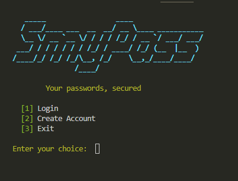
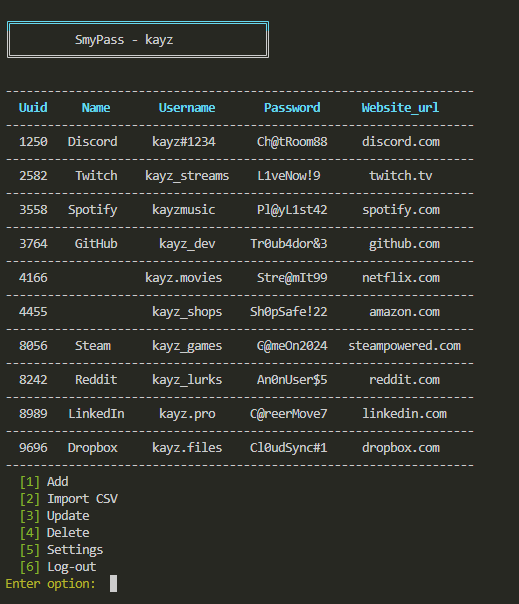

# SmyPass 🔐
> A terminal-based password manager built in Python.


🎬 **[Watch the Demo](https://youtu.be/DsWJugKwNZI)**
---

## What is SmyPass?

SmyPass is a CLI password manager that lets you securely store and manage your credentials from the terminal. It supports multiple users, encrypted vaults, breach/strength checking on passwords, CSV imports from browser exports, and a clean colored, tabulated interface — all without leaving the command line.

---
## Preview

| Splash Screen | Vault View |
|---|---|
|  |  |

---

## Current Features

- Multi-user registration & login
- Password hashing with **Scrypt** (key derivation)
- Per-user encrypted credential vaults (Fernet/AES)
- Add, update, and delete saved credentials
- Password breach checking (Have I Been Pwned via `pwnedpasswords`)
- Password strength policy checks (length, uppercase, numbers, special characters)
- Auto-generated strong passwords on request
- Import credentials from a browser-exported CSV file
- Automatic site-name cleanup on import (via `tldextract`)
- Session timeout on inactivity, with safe return to the home menu
- Account settings (change password, delete account)
- Colorized, bordered CLI screens (`colorama`) with a figlet splash banner (`pyfiglet`)
- Clean tabulated vault display with horizontal-only row separators (`prettytable`)

---

## Project Status

SmyPass is currently at **v1.0**.

| Version | Status |
|---------|--------|
| v0.1 — Basic CRUD | ✅ Done |
| v0.2 — Fernet vault encryption | ✅ Done |
| v0.3 — Replace MD5 with Scrypt | ✅ Done |
| v0.4 — Password strength checker | ✅ Done |
| v0.5 — Breach checking + CSV import | ✅ Done |
| v1.0 — Polished CLI (colors, banner, session timeout) | ✅ Done |
| v2.0 — Cross-platform + packaging | 🔜 Planned |
| v2.0 — Database backend | 🔜 Planned |
| v2.0 — Graphical UI | 🔜 Planned |

---

## Installation

```bash
git clone https://github.com/simbarashekamwara/SmyPass.git
cd SmyPass
pip install -r requirements.txt
python smypass.py
```

### Dependencies

| Library | Purpose |
|---------|---------|
| `cryptography` | Fernet encryption + Scrypt key derivation |
| `getpass` | Hidden password input |
| `pwnedpasswords` | Checks passwords against known data breaches |
| `password_strength` | Enforces password strength policy |
| `inputimeout` | Session timeout on inactive input |
| `csv` | Parsing imported credential files |
| `tldextract` | Cleaning up site/domain names on CSV import |
| `prettytable` | Tabulated vault display with horizontal row separators |
| `colorama` | Colored terminal output |
| `pyfiglet` | ASCII-art splash banner |

Install all at once:
```bash
pip install cryptography pwnedpasswords password_strength inputimeout tldextract prettytable colorama pyfiglet
```

---

## File Structure

```
SmyPass/
├── smypass.py          # Main application
├── smypass_guard.py    # Password strength & breach checking
├── requirements.txt    
└── README.md
```

---

## Security

- Passwords hashed with **Scrypt** (not MD5 or SHA)
- Vault credentials encrypted at rest with **Fernet (AES-128)**
- Hidden password input via `getpass`
- Passwords checked against known data breaches before being saved
- Enforced password strength policy (length, case, numbers, special characters)
- Session auto-locks back to the home menu after a period of inactivity

## Author

Built by **[Simbarashe Kamwara]** 
🔗 [LinkedIn](https://www.linkedin.com/in/simbarashekamwara) · [GitHub](https://github.com/simbarashekamwara)

---
